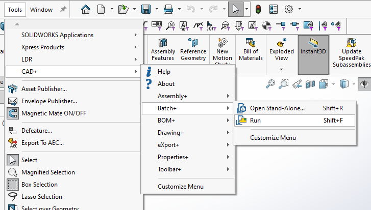
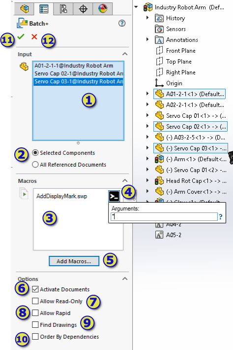
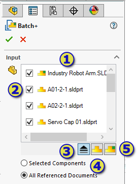
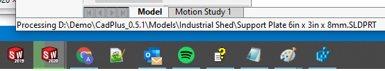
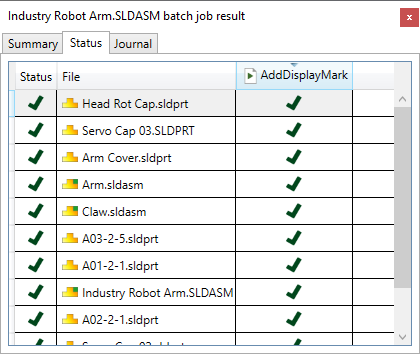

Batch+ can be run directly within assembly environment.

In this case custom macro can be run on the selected components or all referenced documents.

1. Option to process selected components or [all referenced documents](#exporting-referenced-documents)
1. Components to run the macro on
1. List of macros to run
1. Optional macro arguments. Specify the arguments in the command line format if macro supports ones. Follow [Macro Arguments](/macro-arguments/) article of the instructions of how to use macro arguments.
1. Button to add macros to the scope
1. Specifies if documents needs to be activated (opened in their own windows). If this option is not selected macro will be run on invisible models. Follow [Model pointer in invisible mode](/batch/user-interface#model-pointer-in-invisible-mode) for more information.
1. Option to specify if unloaded documents can be opened read-only. This option will only apply to the documents not currently loaded in SOLIDWORKS (or as a part of assembly components), such as suppressed components, lightweight components or components of the assembly opened in the Large Design Review mode
1. Option allows to specify if components can be opened in the rapid mode (Large Design Review for assemblies or Detailing mode for drawings)
1. Option to automatically save files
1. Option allows to additionally include drawings referenced by the components of the assembly. This provides similar functionality of [Extract References](/batch/extract-references/)
1. Order by Dependencies option allows to order the input references based on the dependency (from children to parents or vice-versa). Refer [Order By Dependencies](/batch/order-by-dependencies/) article for more information.
1. Start the batch process
1. Cancel the batch process

## Exporting Referenced Documents

1. List of files to be processed
1. Toggle option to exclude certain files from processing
1. Option to toggle between top level references only or all references
1. Option to check/uncheck all part documents in current selection
1. Option to check/uncheck all assembly documents in current selection

## Running The Batch process

Progress of the batch operation is reported in the progress bar in SOLIDWORKS icon. And the currently processed file is displayed in the status bar.

After completion the result, summary and log page is displayed.

