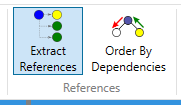
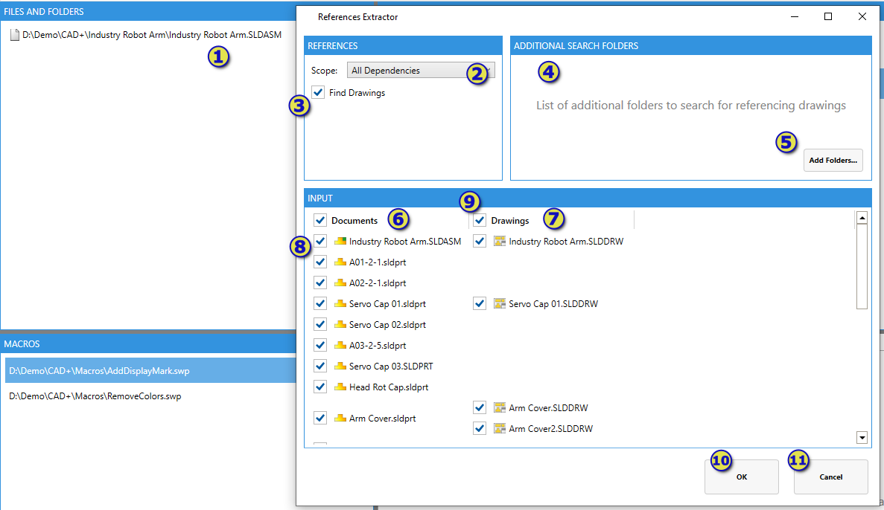

Batch+ allows to additionally include all referenced documents and drawings into the batch process.

For example it is possible to extract children references of input assembly or drawing documents.

In order to enable this option select the **Extract References** toggle in the **References** group of the **Input** tab.

Batch+ will find all the references and present the result in the following dialog.

1. Input file (usually assembly or drawing) to get references from
1. Scope of references (e.g. all dependencies or top level only dependencies)
1. Option to find all the drawings which referencing this document
1. Additional drawing folders. By default the drawings will be searched through all the folders and sub-folders of the input references (parts or assemblies). This option allows to specify additional directories if the drawing are stored in the external folders.
1. Add additional search folders to the scope
1. List of input documents
1. List of input drawings of the **Find Drawings** option is selected
1. Toggle to select/deselect specific references to be included into the batch job
1. Toggle to select/deselect all references from the column. For example if it is only required to process drawing unchecking this option for **Documents** column will exclude all parts and assemblies from the job.
1. Continue the batch process
1. Cancel the batch process