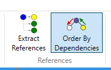

In some cases it might be beneficial to order the files based on their parent-child relationship. For example it might be required to firstly process all part files followed by sub-assemblies, top level assemblies and drawings. This can ensure the files are not getting out-of-date when macros modifying the models.

This is especially important when files are managed by PDM systems, such as SOLIDWORKS PDM.

> For example if [Rebuild](https://www.codestack.net/solidworks-api/document/rebuild/) macro is employed to upgrade all the SOLIDWORKS files it should process lower level parts before processing assemblies and drawings. Otherwise assemblies might have **Needs Rebuild** flag as their children were processed and rebuild after the assembly.

In order to enable this option select the **Order By Dependencies** toggle in the **References** group of the **Input** tab.

Batch+ will collect all the references and present the result in the following dialog.

It is possible to specify the order, e.g. **Children To Parents** or **Parents To Children**. It is also possible to only process top level files.

> In some cases it may appear that the part is the top level file (sometimes higher than the assembly it is inserted to). This happens due to the fact part has an external reference to the assembly (in-context relation) which makes it both a parent and a child of the assembly at the same time.