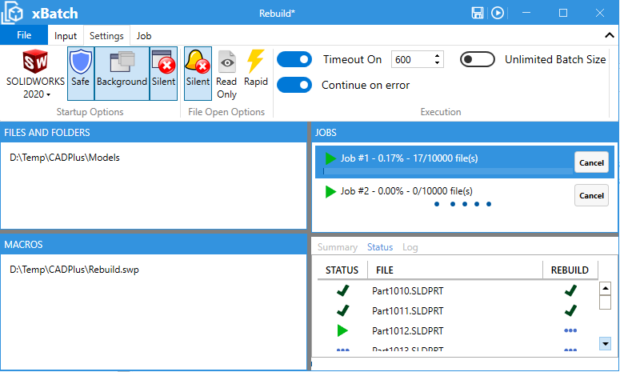

Batch+ is a stand-alone utility allowing to run specified macros for each specified SOLIDWORKS models in a batch mode.

This utility ensures integrity of the process by monitoring SOLIDWORKS crashes, hang and restarting application when needed.

Once installed application icon is available in the Windows start menu

> It is strongly recommended to backup your data before using the batch operation as it may irrevocably modify files