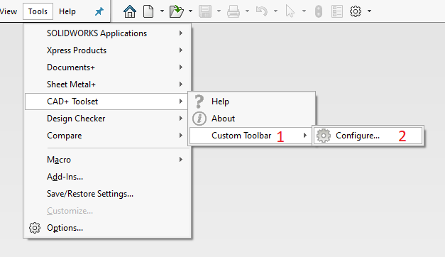
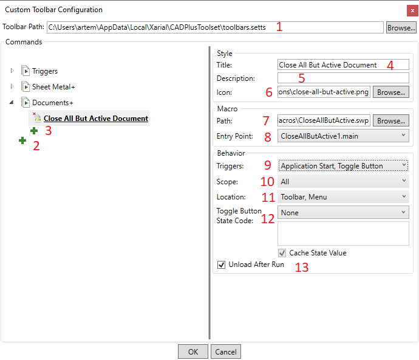
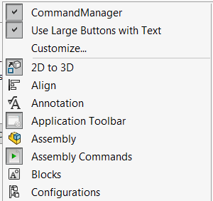

## Adding Macro Buttons And Toolbars

Macro buttons can be configured by clicking on 'Configure...' command in Custom Toolbar menu in SOLIDWORKS

{ width=550 }

1. Custom Toolbar sub-menu in SOLIDWORKS Tools menu
1. Button to configure toolbar

Configuration dialog is displayed and existing toolbar and buttons can be modified as well as new can be added.

Click on green plus (+) button to add new toolbar or macro button.

Configure the parameters as shown below:

### Configuring Macro Buttons In Toolbar

{ width=650 }

1. Path to toolbar file. This setting is stored locally to the user. UNC path is supported if required to configure a [shared toolbar](../multi-user/)
1. Add new toolbar
1. Add new macro button in toolbar
1. Title of the macro button. It displayed as a bold header in the tooltip when mouse hovers a button in SOLIDWORKS toolbar
1. Description of the macro button. It displayed as a sub-header in the tooltip and in the SOLIDWORKS task bar in the bottom right corner when mouse hovers a button in SOLIDWORKS toolbar
1. Icon of the macro button. Optimal size is between 16x16 and 120x120 in PNG format, however image will be automatically scaled and aligned which allows support for any size (including different width and height). Transparency is supported.
1. Full path to macro to run
1. Macro entry point. This is the subroutine which should be run first when executing the macro. This is a parameterless subroutine (usually named main). Custom Toolbar will try to automatically find the best suitable subroutine
1. Command location. Identifies where command should be added (menu, toolbar)
1. Command scope. Identifies the scope (part, assembly, drawing, no documents) where macro can be run. Macro will be disabled in the not selected environments
1. Triggers. Macro trigger options. Follow [triggers](triggers) article for more information
1. Unload After Run. If option is checked macro will be automatically unloaded after run. This option is useful when macro is [shared](../multi-user/) across different users. In this case macro wil lbe released immediately enabling the possibility to replace the macro with new version. This option cannot be used if macro displays User Form as in this case it will be immediately unloaded and form will be closed. Untick this option if macro uses User Form or any other popup Window.

### Configuring Toolbar

{ width=650 }

1. Toolbar title to be displayed in the SOLIDWORKS toolbars manager
1. Toolbar tooltip
1. Toolbar icon
1. Preview of toolbar icon (default icon)

### Modifying Commands

Select macro buttons and toolbars to load and edit the parameters. Use context menu or commands box to reorganize the commands as shown below.

{ width=550 }

1. Move selected macro button to the left or move toolbar up
1. Move selected macro button to the right or move toolbar down
1. Add new macro button left to the selected macro button or add new toolbar above the selected toolbar
1. Add new macro button right to the selected macro button or add new toolbar below the selected toolbar
1. Remove selected macro button or toolbar
1. Save changes and close dialog
1. Close dialog without saving changes

## Saving Changes

If toolbar configuration changed the following message is displayed and SOLIDWORKS needs to be restarted for settings to take effect (unless toolbar is read-only in multi-user environment).

{ width=350 }

## Accessing Macro Buttons

Toolbars are available in the SOLIDWORKS toolbars list:

{ width=250 }

and in the SOLIDWORKS menu.

{ width=450 }

Toolbars can be reorganized and placed into the SOLIDWORKS command manager area. Visit [Customization](../customization/) page for additional customization options for the toolbars and commands.

{ width=350 }