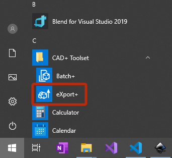

eXport+ module is a stand-alone (.exe) application which is utilizing SOLIDWORKS eDrawings to publish the files to a list of formats.

It is required to have eDrawings Viewer installed to use the tool, but it is not required to have SOLIDWORKS application installed. Download eDrawings by following the [link](https://www.edrawingsviewer.com/download-edrawings)

> Currently eXport+ only works with eDrawings 2020

The following output formats are supported:

* eDrawings Files (*.eprt, *.easm, *.edrw)
* eDrawings Zip Files (*.zip)
* eDrawings Executable Files (*.exe)
* eDrawings Web Html Files (*.html)
* eDrawings ActiveX Html Files (*.htm)
* Stereolithography Files (*.stl)
* Bitmap Files (*.bmp)
* TIFF Image Files (*.tif)
* JPEG Image Files (*.jpg)
* PNG Image Files (*.png)
* GIF Image Files (*.gif)
* PDF Files (*.pdf). This option is currently EXPERIMENTAL. This option is not stable. Refer issues [#12 - PDF output is not consistent](https://github.com/xarial/cad-plus/issues/12) and [#15 - PDF export is corrupt\zero size](https://github.com/xarial/cad-plus/issues/15)

## Video Demonstration



## Notes

* eXport+ will automatically hide all the popup messages if any are shown thus allowing the automated exports without the need of user interventions.
* eXport+ will process all sub-folders if folder(s) is specified as an input
* Output files will be named after input files. If file already exists, index will be added to the file name, e.g. *File (1).html*, *File (2).html*

After installation of CAD+ Toolset, eXport+ application can be found in the Windows Start Menu.

eXport+ provides [user interface](user-interface) and [command line interface](command-line) for configuring the publishing job.