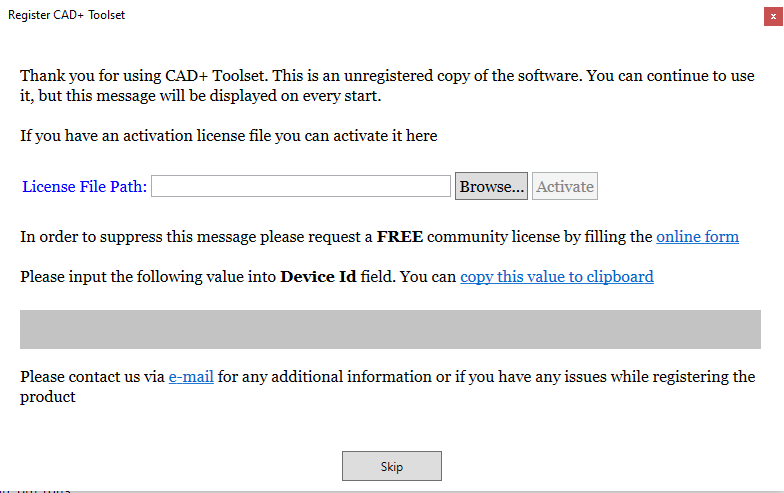

{ width=200 }

**CAD+ Toolset (Beta)** application complements functionality of SOLIDWORKS by enabling additional toolsets. Application allows to automate various areas of SOLIDWORKS application. This includes but not limited to custom properties automation, geometry features, custom toolbars, export and import capabilities etc.

## Features

**CAD+ Toolset** is packaged in 4 editions:

* **Community Edition**. Free and open source version of the application. Source code is available on the [GitHub](https://github.com/xarial/cad-plus). Community edition can also be used for commercial use.

* **Standard Edition**, **Professional Edition**, **Premium Edition**. Paid versions of the application. Provides additional features and benefits.

Please see the table below for the list of features and their availability in the specific editions.

| Feature                                                           | Community Edition | Standard Edition | Professional Edition | Premium Edition |
|-------------------------------------------------------------------|:-----------------:|:--------------------:|:--------------------:|:--------------------:|
| [eXport+ User Interface](/export/command-line/)                      | &#x2714;          | &#x2714;             | &#x2714;             | &#x2714;             |
| [eXport+ Command Line](/export/user-interface/)                      | &#x2714;          | &#x2714;             | &#x2714;             | &#x2714;             |
| [Toolbar+](/toolbar)                                 | &#x2714;          | &#x2714;             | &#x2714;             | &#x2714;             |
| [Toolbar+ Triggers](/toolbar/configuration/triggers) | &#x2714;          | &#x2714;             | &#x2714;             | &#x2714;             |
| [Batch+ User Interface](/batch/command-line/)                    | &#x2714;          | &#x2714;             | &#x2714;             | &#x2714;             |
| [Batch+ Command Line](/batch/user-interface/)                    | &#x2714;          | &#x2714;             | &#x2714;             | &#x2714;             |
| [Batch+ For Assemblies](/batch/assembly/)                    | &#x2714;          | &#x2714;             | &#x2714;             | &#x2714;             |
| [Arguments supported macros](/macro-arguments/)                    | &#x2714;          | &#x2714;             | &#x2714;             | &#x2714;             |

## Download

**Community Edition** can be downloaded by following the instructions on the [download page](/download/).

When starting the application for the first time the following message will be displayed.

{ width=500 }

You can continue to use unregistered version, but we encourage you to register your copy to suppress the popup message. Please find more information on [register](/register/) page

**Standard Edition**, **Professional Edition**, **Premium Edition** are not yet available for download.

## Updates

Tools will automatically check for the available updates on the start. If new update is available the following modeless popup will be displayed. Popup will automatically close in 20 seconds unless closed prior.

{ width=500 }

## Feedback

Software is currently in Beta-testing mode. Enhancement requests and bug reports can be submitted via [ticketing system](https://github.com/xarial/cad-plus/issues). See the list of [open issues](#github-issues).

You can vote for the ticket by adding the *thumb up* to the ticket description:

Tickets will be prioritized based on the votes.

> We will try to include the tickets raised by the community to a free Community edition, however we cannot guarantee this and the implemented feature can be added to the Professional Edition

You can also contact the development team by sending e-mail directly to [info@xarial.com](mailto:info@xarial.com)

