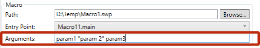

Toolbar+ can pass [Macro Arguments](/macro-arguments/) to the macro.

Arguments should be specified in command line format in the corresponding field

> Enclose value into quote "" if value contains space or new line symbol

Toolbar+ will parse the arguments and assign this to a variant of strings **Args**

Following code snippet can be used within VBA macro to retrieve the arguments.

~~~ vb
Dim macroRunner As Object
Set macroRunner = CreateObject("CadPlus.MacroRunner.Sw")

Dim param As Object
Set param = macroRunner.PopParameter(swApp)
    
Dim vArgs As Variant
vArgs = param.Get("Args")
~~~