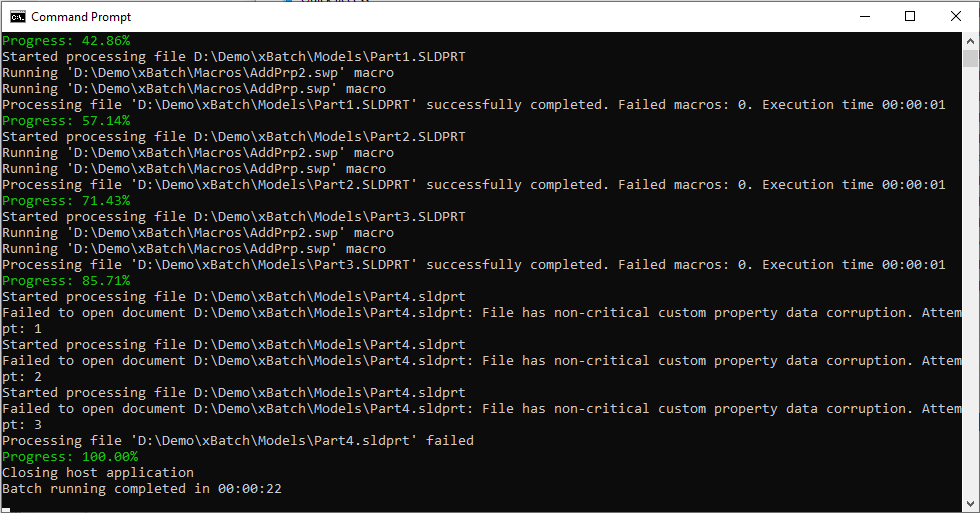

Refer the list of available arguments below. Use -- symbol to use arguments. Use --help argument to display help i the console.

For example the below command will open all SOLIDWORKS part files from the *D:\Demo\xBatch\Models* folder and run 2 macros: Macro1.swp and Macro2.swp. SOLIDWORKS 2020 will be started silently and in the background.

> \> xbatch.exe -i "D:\Demo\xBatch\Models" -f "*.sldprt*" -e -m "D:\Demo\xBatch\Macros\Macro1.swp" "D:\Demo\xBatch\Macros\Macro2.swp" -s silent background -v 2020

| Short Flag  | Flag  |Required   | Summary  |
|---|---|---|---|
| -i  | --input  |Yes   | List of input directories or file paths to process. These are files which can be opened by SOLIDWORKS (e.g. SOLIDWORKS files, CATIA, STEP, DXF/DWG, etc.)  |
| -m  | --macros  |Yes   | List of macros to run: VBA macros (*.swp or *.swb) and VSTA macros (*.dll) are supported  |
| -f  | --filter  | No  |  Filter to extract input files, if input parameter contains directories |
| -e  |  --error | No  | If this option is used export will continue if any of the files or formats failed to process, otherwise the export will terminate  |
| -t  |  --timeout | No  | Timeout in seconds for processing a single file (e.g. opening the file and running the macros)")]
| -s  |  --startup | No  | Specifies the startup options (silent, background, safe) for the host application. Multiple option can be used
| -v  |  --hostversion | No  | Version of SOLIDWORKS application. Use one of the following formats: 2020, Sw2020, SOLIDWORKS 2020. If this option is not specified than the oldest version installed on this system will be used.

