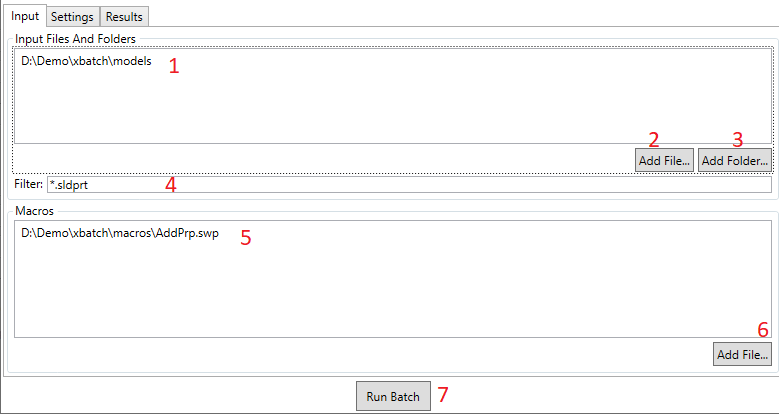
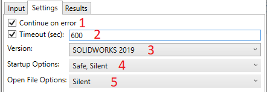
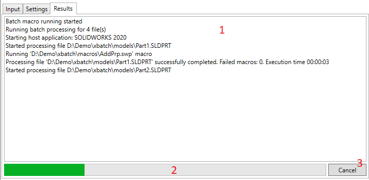

User Interface provides a visual way to configure the batch process. There are 3 tabs in the application

1. Input tab to provide input files and macros
1. Settings tab to configure the inputs
1. Results tab to track the progress of the operation

## Input

1. Input files and folders scope. Use *Add Files...* (2) and *Add Folders...* (3) buttons to add new files and folders. Press *del* button on keyboard to remove the selected files or folders from the list. Alternatively drag-n-drop files and folders directly to the list.
1. Browsing the file to add to the exporting process.
1. Browsing the folder to add to the exporting process
1. Filter for files when processing folder. You can use a * wildcard, e.g. \*.sld\* will filter all SOLIDWORKS files (.sldprt, .slddrw and .sldasm) and exclude all other files types.
1. List of macros to run. Multiple macros can be selected
1. Browsing the macro to run
1. Button to start batch process. Button enables when all inputs and macros are specified

## Settings

1. Allows batch process to continue if any of the files failed to process (for example file cannot be opened). If this option is not checked, batch process will be terminated once the error appears.
1. Processing timeout in seconds for processing a single file
1. Version of SOLIDWORKS to launch for opening files and running macros
1. SOLIDWORKS launching startup options:
    * Safe - runs SOLIDWORKS in safe mode bypassing options
    * Silent - runs SOLIDWORKS and with disabled popup messages and splash screen
    * Background - runs SOLIDWORKS in background. This option only available for SOLIDWORKS Professional or higher
1. SOLIDWORKS files open options
    * Silent - suppresses all popup dialogs, such as missing references when opening file
    * Read Only - open files in read-only mode ensuring it cannot be overwritten
    * Rapid - open files in a rapid mode:
        * For drawings - opens in detailing mode. Some of the APIs might not be available in this mode
        * For parts and assemblies - currently not supported and will be ignored

## Results

1. Text log of the operations. Use this log to troubleshoot errors.
1. Current progress of batch operation
1. Cancel the current operation