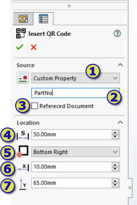
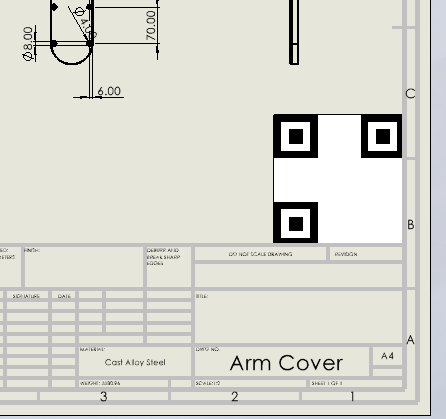
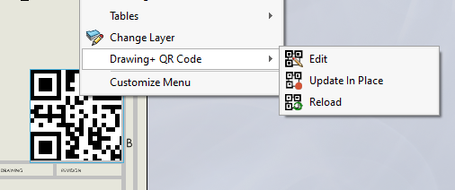

This module allows to insert QR code into the drawing document and encode specified information linked to the document.

1. Source of the data to be used for the QR code
    * Custom Property - reads the value of the custom property
    * File Path - reads the value of the full file path of the document
    * Part Number - reads the value of the BOM Part Number from the configuration settings
    * PDM Vault Link - Conisio URL link to the file in SOLIDWORKS PDM Professional vault
    * PDM Web2 Url - Web Url for the file in the Web2 interface of SOLIDWORKS PDM
    * Custom - any custom data
1. Argument of the source, depending on the source selected from previous step
    * Custom Property - name of the custom property
    * PDM Web2 Url - Url of the Web2 host
    * Custom - Text data
    * File Path, Part Number, PDM Vault Link - Not used
1. Specifies if the data needs to be extracted from the referenced document (e.g. part or assembly) instead of the drawing
1. Size of the QR code
1. Dock location of the QR code
    * Bottom Left
    * Top Left
    * Bottom Right
    * Top Right
1. X Offset from the dock location specified in the previous step
1. Y Offset from the dock location specified in the previous step

Preview of QR code is updated when location options are modified

QR Code can be edited or updated after the insertion by accessing the corresponding commands in the context menu.

* **Edit** - allows to edit the data of the current QR cod ein the Property Manager Page.
* **Update In Place** - reloads the data of the QR code but keeps the current size and location of the QR code. This can be useful if the data has changed (e.g. custom property)
* **Reload** - similar to the **Update In Place**, but ignores the current location and uses the location and size specified when QR code was first inserted. This option is useful of QR code is inserted into the template and needs to be updated. This option will ensure the proper sizing and location of QR code regardless of the sheet scale.