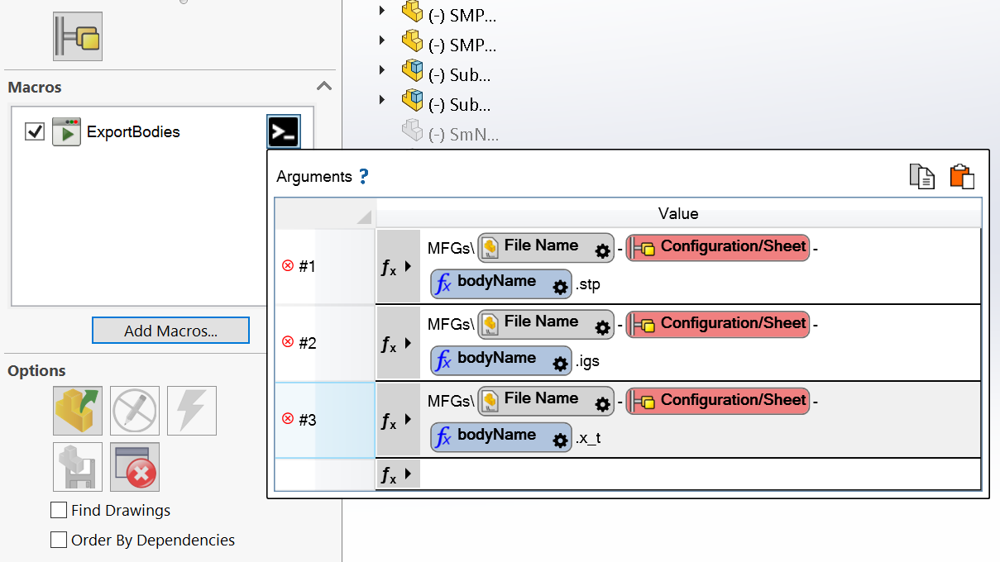

# Export Bodies

This VBA macro exports individual bodies to foreign formats.

Pass output file paths (relative to the source file folder) with an extension as macro arguments. For example: `"MFGs\{ path [FileNameWithoutExtension] }-{ confOrSheet }-{ bodyName }.stp" "MFGs\{ path [FileNameWithoutExtension] }-{ confOrSheet }-{ bodyName }.igs" "MFGs\{ path [FileNameWithoutExtension] }-{ confOrSheet }-{ bodyName }.x_t"`

Custom **bodyName** variable can be used for the body name value in the expression

Macro will create folder if not exists.

Macro can be run from Batch+ for single or all configurations

