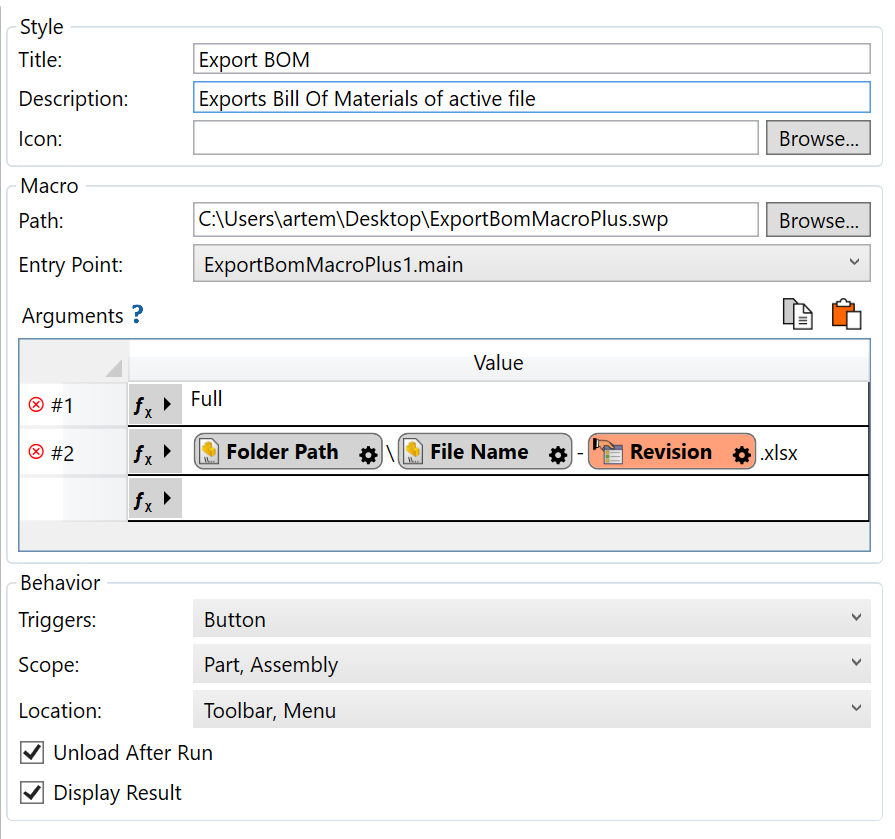

# Export BOM via BOM+ from with arguments

This VBA macro demonstrates how to export Bill Of Materials from the active assembly or part document via [BOM+](https://cadplus.xarial.com/bom/) API using Macro+ framework

This macro expects 2 arguments (either in [Toolbar+](https://cadplus.xarial.com/toolbar/) or [Batch+](https://cadplus.xarial.com/batch/)):

1. Name of the BOM+ template
1. Full output file path of the template including the extension. Folder must exist

Example of parameters to export BOM template **Full** to the active file's folder with the name of active files and value of custom property **Revision** into the **Excel** format

`"Full" "{ path [Folder] }\{ path [FileNameWithoutExtension] }-{ prp [Revision] }.xlsx"`

