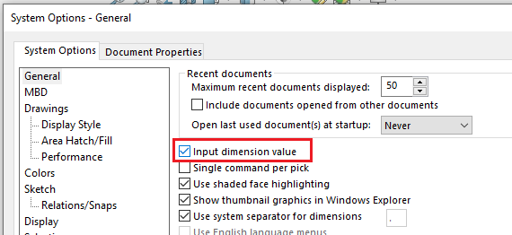

Toggle behavior can be assigned to the button and menu command allowing to switch between checked/unchecked state of the button.

In order to activate toggle behavior select **Toggle Button** option from the triggers drop-down.

> Note, the same macro will be run regardless of toggle button is checked or unchecked. The current state needs to be determined in the macro itself to run the appropriate portion of the code.

## Configuration

Once **Toggle Button** option is selected in the triggers, the following options can be configured.

1. Toggle Button Status Code Type - type of resolving the state of the button
    * None - there is no custom logic of state. Button is loaded as checked by default and state will be changed on every button click.
    * VB.NET - allow to specify custom VB.NET code which resolves the state of the button in a given moment
1. Toggle button state resolve code. Code which calculates the current state of the button if VB.NET option is selected. This code will be executed every time to resolve the state of the button. 
> Note, this code will be run every time state of SOLIDWORKS changes, e.g. mouse however, selection, rebuild, i.e. potentially thousands of times per session. So it is only recommended to use simple code to avoid performance issues or use the **Cache State Value** option

3. Cache State Value - if this option is checked then the resolve code runs only once on start to resolve the initial state of the button (check/unchecked). After that toggle state will be switched on every click without calling the resolve code.

### Custom Code Resolver

When specifying the code to resolve the state, it is required to complete the construction of the function within the class which returns boolean, where *true* corresponds to checked state and *false* to unchecked.

Function provides an access to top level application (IXApplication from [xCAD.NET framework](https://xcad.xarial.com/)). Use late binding to access underlying SOLIDWORKS API objects.

~~~ vb
Imports Xarial.CadPlus.CustomToolbar.Base
Imports Xarial.XCad

Namespace Xarial.CadPlus.CustomToolbar.Services.ToggleButton
    Public Class ResolverClass
        Implements IToggleButtonStateResolver

        Public ReadOnly Property Application As IXApplication Implements IToggleButtonStateResolver.Application

        Public Sub New(ByVal app As IXApplication)
            Application = app
        End Sub

        Public Function Resolve() As Boolean Implements IToggleButtonStateResolver.Resolve
            <Code from {Toggle button state resolve code}>
        End Function
    End Class
End Namespace
~~~

#### Example

This example demonstrates how to create toggle button which switches on and off the *Input dimension value* setting. Macro should correctly display the state of the button as checked and unchecked depending on the state of this user preference.

In order to find the current value of this setting it is required to call the [ISldWorks::GetUserPreferenceToggle](https://help.solidworks.com/2013/english/api/sldworksapi/solidworks.interop.sldworks~solidworks.interop.sldworks.isldworks~getuserpreferencetoggle.html) API and pass the value of **swInputDimValOnCreate**.

As it is required to use late binding, corresponding integer value of the enumeration should be found:

Adding the following code would result into the check state of the button to be synchronized with the toggle option:

~~~ vb
Return CType(Application, Object).Sw.GetUserPreferenceToggle(10)
~~~

The macro code itself to toggle the state can be defined as follows

~~~ vb
Dim swApp As SldWorks.SldWorks

Sub main()

    Set swApp = Application.SldWorks
    
    Dim curVal As Boolean
    curVal = False <> swApp.GetUserPreferenceToggle(swUserPreferenceToggle_e.swInputDimValOnCreate)
    
    swApp.SetUserPreferenceToggle swUserPreferenceToggle_e.swInputDimValOnCreate, Not curVal
    
End Sub
~~~

As the result the toggle button will always be synchronized with user preference setting and can be triggered via button or from settings dialog.