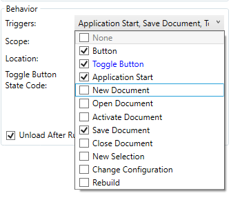

It is possible to configure the trigger for the macro to be executed. Multiple triggers for the same macro are supported.

* None - macro will not be executed. This is equal to disabling the macro
* Button - macro button will be created in the toolbar or menu (as per the Location setting). Macro will be executed once command is clicked
* Toggle Button - button with checked/unchecked state. Follow [Toggles](../toggles/) article for more information.
* Application Start - macro will be executed when SOLIDWORKS application starts
* New Document - macro will be executed when new document (part, assembly or drawing is selected)
* Open Document - macro will be executed when existing document is opened
* Activate Document - macro will be executed when active document changes
* Save Document - macro will be executed before the document saved
* Close Document - macro will be executed before the document closes
* New Selection - macro will be executed once new object is selected in the SOLIDWORKS model
* Change Configuration - macro will be executed when active configuration (in part and assembly) or sheet (in drawing) is changed
* Rebuild - macro will be executed once document is rebuilt