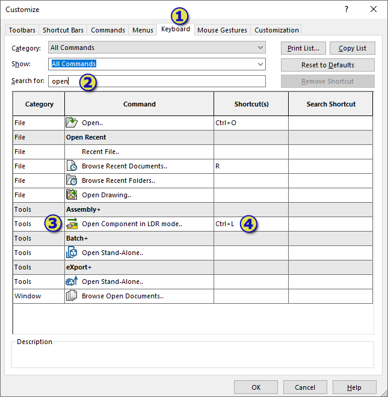
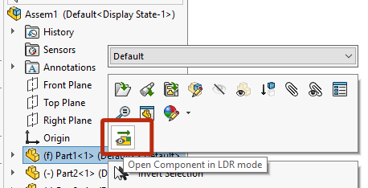
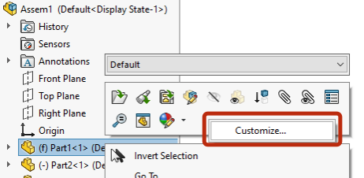

Commands created with Toolbar+ can be additionally customized using SOLIDWORKS functionality.

Navigate to *Customize...* menu in SOLIDWORKS by clicking on the empty space in toolbar or command manager area in SOLIDWORKS application.

{ width=250 }

## Assigning shortcuts to commands

To assign shortcut navigate to *Keyboard* tab and search for the command from Toolbar+ (either select the toolbar from the drop-down menus or type command name):

{ width=550 }

Click on the *Shortcut(s)* cell and assign the key combination.

## Adding commands to command manager tab boxes

Commands created with Toolbar+ can be hosted on any other toolbar or command tab boxes. 

Navigate to the toolbar in the *Commands* tab of the *Customize* dialog.

Drag-n-drop the required command into the SOLIDWORKS toolbar area (other toolbar or command tab box)

> Due to current limitation, the commands are not rendered properly in the *Buttons* area as shown on the picture below. But still can be dragged onto the toolbar and will function as normal.

## Adding commands to context menu

Some commands usually execute in the selection context (for example requires preselection of certain objects, e.g. components).

In this case it will be beneficial to host command in context menu.

In order to add command to context menu. Select the target context menu and click **Customize...**

Find the required command and drag-n-drop it to the target position in the context menu.

