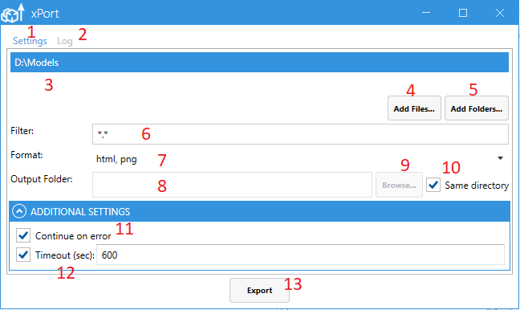
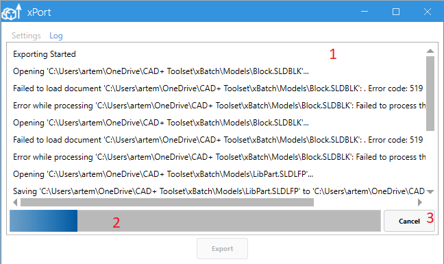
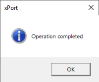

User Interface provides a visual way to configure the export process. There are 2 tabs in the application

1. Settings tab to configure the inputs
1. Log tab to track the progress of the operation

## Settings

3. Input files and folders scope. Use *Add Files...* (4) and *Add Folders...* (5) buttons to add new files and folders. Press *del* button on keyboard to remove the selected files or folders from the list. Alternatively drag-n-drop files and folders directly to the list.
3. Browsing the files to add to the exporting process.
3. Browsing the folders to add to the exporting process
3. Filter for files when processing folder. You can use a * wildcard, e.g. \*.sld\* will filter all SOLIDWORKS files (.sldprt, .slddrw and .sldasm) and exclude all other files types.
3. List of formats to output. Multiple formats can be selected

8. Output folder to store the results. Path can be pasted directly to this box or *Browse...* (9) button can be used instead.
8. Browsing the output folder to store the results
8. Output files in the same directory as original files
8. Allows exporting process to continue if any of the export operations fail (for example one of the files in the queue is broken). If this option is not checked, export process will be terminated once the error appears.
8. Processing timeout in seconds of exporting a single file to single output format (e.g. exporting Part1.sldprt to Part1.html)
8. Button to start exporting process. Export button enables when all required inputs are specified (input folders and files and export formats)

## Log

1. Text log of the operations. Use this log to troubleshoot errors.
1. Current progress of export operation
1. Cancel the current operation

Once the process completes, the following message box is shown

This message will be also shown if there were errors while exporting, but *Continue on error* (11) option is selected.

If export fails, error message is displayed.

